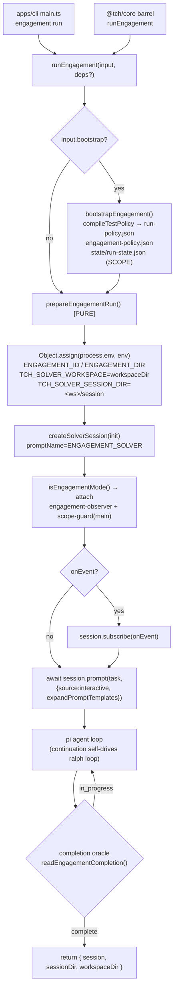
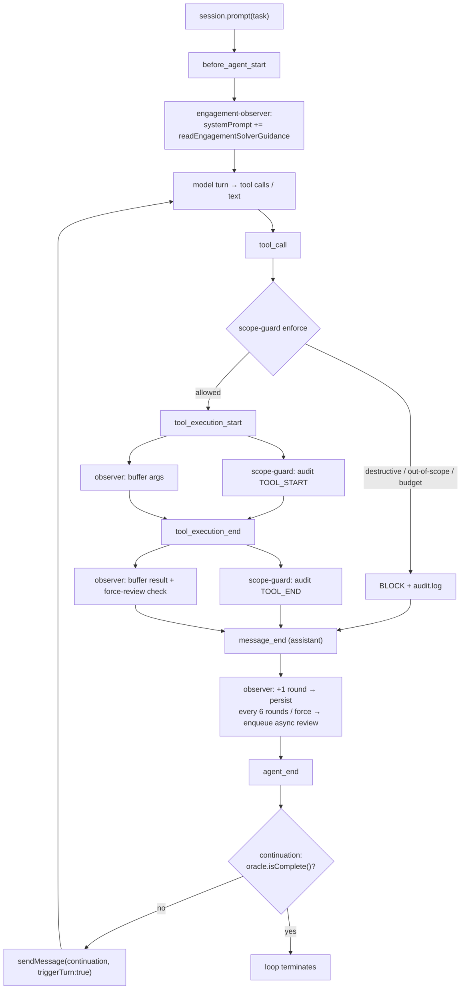
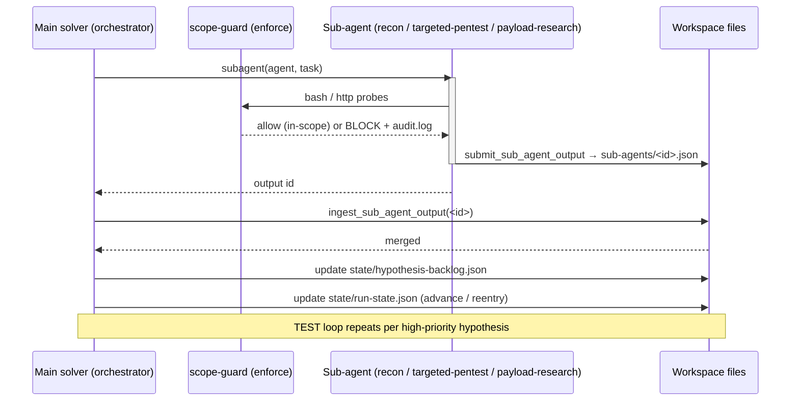
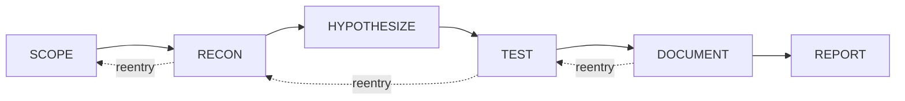

# Engagement Backend Architecture (Call-Logic)

This document describes the backend call logic of the **engagement** path — the
enterprise authorized black-box pentest engine built on top of BreachWeave's
CTF kernel (de-CTF-ified across Slices 1–5b, launched by Slice 6). It is the
authoritative map from the CLI entrypoint down through the pi agent loop, the
three engagement pi-extensions, the solver tools, the sub-agent fan-out, and the
on-disk state.

Everything below uses **real file/function names** from `packages/core/src`. If
a name here drifts from the code, the code wins.

> **Scope note.** This is the *engine* (single-target, single main-solver +
> sub-agent fan-out). The **Campaign multi-target scheduler is NOT wired** — see
> [§8](#8-whats-not-wired-honest-limits). RECON's actual discovery is the
> solver + its skills exercising real network egress; there is no separate crawler
> service.

---

## 1. End-to-end run (bootstrap → env → session → agent loop)

The single entrypoint is `runEngagement` (`engagement/run.ts`), reached either
from the CLI (`apps/cli/src/main.ts` → `engagement run`) or programmatically via
the `@tch/core` barrel (`packages/core/src/index.ts`).

### 1.1 ASCII

```
apps/cli/src/main.ts  (engagement run)
  └─ build TestPolicy from --classes/--depth/--red-line, split --targets/--seeds
  └─ runEngagement({ engagementId, workspaceDir, task, solverId,
                     bootstrap:{...}, onEvent })
        │
        ▼
engagement/run.ts :: runEngagement(input, deps?)
  1. deps.bootstrap ?? bootstrapEngagement   (only if input.bootstrap given)
  2. { env, init } = prepareEngagementRun(input)   ← PURE, SDK-free
  3. Object.assign(process.env, env)
  4. deps.createSession ?? createSolverSession(init)
  5. if onEvent → session.subscribe(onEvent)
  6. await session.prompt(task, { source:"interactive",
                                  expandPromptTemplates:true })
  7. return { session, sessionDir, workspaceDir }

prepareEngagementRun(input) → env:
  ENGAGEMENT_ID          = engagementId      (activates isEngagementMode())
  ENGAGEMENT_DIR         = workspaceDir       (engagement/pentest-workspace root)
  TCH_SOLVER_WORKSPACE   = workspaceDir       (CRITICAL: solver ctx.cwd = workspace)
  TCH_SOLVER_SESSION_DIR = <workspaceDir>/session
                            init = { solverId, promptName:"ENGAGEMENT_SOLVER", task }

bootstrapEngagement(engagement/bootstrap.ts):
  ensurePentestWorkspace(dir)                       (idempotent; keeps findings)
  compileTestPolicy(policy, targets) → run-policy.json
  engagement-policy.json  (full TestPolicy + targets + seeds)
  state/run-state.json    (phase = SCOPE)

createSolverSession(solver/session.ts):
  reads TCH_SOLVER_WORKSPACE / TCH_SOLVER_SESSION_DIR (defaults per solverId)
  isEngagementMode() ? [ engagementObserverExtension,
                         scopeGuardExtension(main, enforce) ]
                     : [ challenge* extensions ]  (CTF path, untouched)
  createAgentSession({ ...opts, cwd:workspaceDir, sessionManager })

session.prompt(...)  → pi agent loop  → continuation extension self-drives
                                         (ralph loop) until the oracle completes
```

`prepareEngagementRun` is pure: no disk, no SDK, no `crypto`, no `new Date`.
Randomness (`solverId`) and time are injected at the CLI/orchestration layer.
`runEngagement` takes injectable `deps = { createSession?, bootstrap? }` so it is
unit-testable (`engagement/run.test.ts`) with fakes — no model, no SDK, no network.

### 1.2 Mermaid



---

## 2. Agent main loop + the three engagement extensions

When `isEngagementMode()`, `createSolverSession` attaches two extension objects to
the main solver; the observer object internally wires **three** behaviors. Each
hooks specific pi lifecycle events.

| Extension (factory) | File | pi events hooked | Effect |
| --- | --- | --- | --- |
| **engagement-observer** | `solver/extension/engagement-observer/index.ts` | `before_agent_start` | Injects dynamic phase/policy guidance (`readEngagementSolverGuidance(dir)`) onto the system prompt. |
| ↳ observer sidecar loop | `attachObserverLoop` (`.../challenge-observer/observer-loop.ts`, engagement host) | `tool_execution_start` / `tool_execution_end` / `message_end` / `agent_end` | Buffers per-round tool logs, persists rounds, async-enqueues reviews every 6 rounds or on force; the review agent maintains the Idea/Memory board and `steer`-corrects. |
| ↳ engagement continuation | `attachEngagementContinuation` (`.../engagement-observer/engagement-continuation.ts`) | `agent_end` | On agent end, if the injected `CompletionOracle` (`createEngagementCompletionOracle`) is not complete, re-prompts (`triggerTurn:true`) to self-drive the ralph loop. |
| **scope-guard** | `solver/extension/scope-guard.ts` (`agentRole:"main"`, `mode:"enforce"`) | `tool_call` (blocking) / `tool_execution_start` / `tool_execution_end` | Blocks destructive commands (`commandIsDestructive`) + out-of-scope targets (`isTargetInScope`), enforces the main direct-action budget, guards machine-owned files, appends `audit.log`. |

Sub-agent sessions (`createSubagentSession`) attach `scopeGuardExtension({agentRole:"subagent", mode:"enforce"})` only.

### 2.1 ASCII — one turn

```
session.prompt(task)
  │
  ├─ before_agent_start ─────► engagement-observer: systemPrompt += guidance
  │                             (persona + current phase + vuln classes + red line)
  │
  ▼  ── model produces tool calls / text ──
  │
  ├─ tool_call ──────────────► scope-guard (enforce): may BLOCK
  │                             · destructive command → block + audit
  │                             · target ∉ allowed_targets → block + audit
  │                             · main direct-action budget → warn/steer/block
  │
  ├─ tool_execution_start ───► observer: buffer args (≤160c); scope-guard: audit TOOL_START
  ├─ tool_execution_end ─────► observer: buffer result (≤160c); scope-guard: audit TOOL_END
  │                             observer: force-review trigger check (new finding/evidence)
  │
  ├─ message_end (assistant) ► observer: +1 round → persist → every 6 rounds
  │                             OR force → enqueue async review (non-blocking)
  │
  ▼ (turn ends)
  └─ agent_end ──────────────► continuation: oracle.isComplete()?
                                  no  → sendMessage(continuation, {triggerTurn:true})
                                  yes → stop (loop terminates)
                                observer: enqueue one final review
```

### 2.2 Mermaid — agent loop with extension hooks



---

## 3. Solver tools and their file effects

The `ENGAGEMENT_SOLVER` prompt (`config/prompts/builtin/ENGAGEMENT_SOLVER.md`)
declares these tools (registered in `config/tools/index.ts`):

| Tool (`name`) | File | Effect on disk / state |
| --- | --- | --- |
| `bash` | SDK builtin (gated by scope-guard) | Executes recon/test commands; every call audited; destructive/out-of-scope blocked. |
| `engagement_transition_phase` | `config/tools/engagement-phase.ts` | Forward/in-place phase move via `transitionToPhase` → rewrites `state/run-state.json` (`isForwardPhaseTransition` rejects backward). |
| `document_finding` | `config/tools/document-finding.ts` | Appends a finding (severity/confidence/remediation/request/response) to `findings.ndjson` + `findings.md`. |
| `subagent` | `config/tools/subagent.ts` | Spawns a sub-agent session (single / parallel / chain) — the fan-out entrypoint. |
| `submit_sub_agent_output` | `config/tools/submit-sub-agent-output.ts` | (sub-agent side) Writes the structured output artifact under `sub-agents/<outputId>.json`. |
| `ingest_sub_agent_output` | `config/tools/ingest-sub-agent-output.ts` | (main side) Reads a sub-agent artifact → updates `state/hypothesis-backlog.json` (+ reentry semantics) and canonical state. |
| `generate_engagement_report` | `config/tools/engagement-report-tool.ts` | `writeEngagementReport` → renders `report.md` + `report.sarif.json` from `findings.ndjson` (idempotent). |
| `security_kimi_search` | (search tool) | Knowledge lookup; no engagement-state write. |

The completion oracle (`engagement/oracle.ts :: readEngagementCompletion`) reads
`state/run-state.json` + `state/hypothesis-backlog.json`: coverage is met once
`TEST` and `DOCUMENT` are completed and no `candidate` hypothesis remains (budget
backstop overrides). That is why `TCH_SOLVER_WORKSPACE` **must** equal the
engagement workspace — otherwise these writes land in the default solver dir and
the oracle/report never see them.

---

## 4. Sub-agent fan-out (spawn → submit → ingest)

The main solver is an orchestrator: it delegates depth to role sub-agents and
consolidates their structured output back into the shared backlog.

Sub-agent prompts (`config/prompts/builtin/`):
`ENGAGEMENT_RECON.md` · `ENGAGEMENT_TARGETED_PENTEST.md` · `ENGAGEMENT_PAYLOAD_RESEARCH.md`
(all `isSubagent:true`, submit contract enforced by `pentest-output.ts`).

### 4.1 ASCII

```
main solver ── subagent(agent="ENGAGEMENT_RECON", task) ──► RECON sub-agent
   ▲                                                          │ crawl/enumerate/fingerprint
   │                                                          │ (scope-guard enforce)
   │                                                          ▼
   │                                       submit_sub_agent_output(role=recon, stage=recon,
   │                                         assets, hypotheses[], candidate_findings[])
   │                                                          │  writes sub-agents/<id>.json
   └── ingest_sub_agent_output(<id>) ◄────────────────────────┘
        → merge hypotheses into state/hypothesis-backlog.json
        → advance / reenter phase in state/run-state.json

(TEST phase: same loop with ENGAGEMENT_TARGETED_PENTEST, one hypothesis at a time,
 goal={achieved,proof,evidence_refs}; PAYLOAD_RESEARCH supplies payload ammo.)
```

### 4.2 Mermaid sequence



---

## 5. ENGAGEMENT_DIR file layout

`ENGAGEMENT_DIR == TCH_SOLVER_WORKSPACE == solver ctx.cwd`. Everything the engine
reads/writes lives here (constants: `pentest-workspace.ts :: PENTEST_WORKSPACE_FILES`
/ `PENTEST_WORKSPACE_DIRS`, `bootstrap.ts :: ENGAGEMENT_POLICY_FILE`,
`report.ts`).

```
<ENGAGEMENT_DIR>/
├── run-policy.json              compiled RunPolicy (allowed_targets, no_scan,
│                                  forbidden_commands, per-role max_tool_calls, recon.profile)
├── engagement-policy.json       full TestPolicy + authorizedTargets + seeds (strategy intent)
├── state/
│   ├── run-state.json           phase state machine (SCOPE→…→REPORT, cycle, reentry, goal)
│   └── hypothesis-backlog.json  HypothesisBacklog (statement/kind/entry_point/priority/status)
├── findings.ndjson              one ReportFinding per line (document_finding, machine-owned)
├── findings.md                  human-readable findings log (document_finding)
├── report.md                    rendered engagement report (generate_engagement_report)
├── report.sarif.json            SARIF 2.1.0 export (generate_engagement_report)
├── sub-agents/                  <outputId>.json / .md artifacts (submit → ingest)
├── audit.log                    scope-guard TOOL_START/END + BLOCK reasons
└── session/                     solver AgentSession transcript (TCH_SOLVER_SESSION_DIR)
    └── .observer/               observer round/state/review-queue store + board
                                   (observer-store.ts; board tables via board-format.ts)
```

> The observer store lives under `TCH_SOLVER_SESSION_DIR` (`<ENGAGEMENT_DIR>/session`),
> i.e. `<ENGAGEMENT_DIR>/session/.observer/` — see `observer-store.ts ::
> resolveObserverRootDir` (`join(solverSessionDir, ".observer")`).

---

## 6. Design extraction: CTF kernel → engagement engine

The engagement engine reuses the CTF champion kernel's *mechanisms* while
replacing the *CTF semantics* (host-bridge / flag / challenge-API) with injected
enterprise oracles/context.

| CTF design (kept mechanism) | Engagement analog | Where |
| --- | --- | --- |
| **Observer sidecar** (async review queue, Idea/Memory board, anti-nag cooldown+fingerprint, `steer` correction) | Same loop, neutral pentest prompt, `document_finding`-driven force-review | `attachObserverLoop` + `engagement-observer/observer-host.ts` |
| **ralph continuation** (`agent_end` → oracle → re-prompt) | `CompletionOracle` = `computeEngagementComplete` (coverage/budget) instead of `challenge_is_completed` | `engagement-continuation.ts` + `oracle.ts` |
| **Completion oracle** (host-bridge `challenge_is_completed`) | `readEngagementCompletion` (TEST+DOCUMENT done, no open candidate; budget backstop) | `oracle.ts` |
| **Context provider** (host-bridge `challenge_get_state`) | `EngagementContextProvider` → phase/scope/coverage/backlog summary | `oracle.ts :: buildEngagementContext` |
| **scope-guard** (audit/enforce, role budgets) | Same, hardened: precise host/subdomain/CIDR scope + PoC-safe destructive red line; enforce for main + subagents | `scope-guard.ts` + `scope-guard-policy.ts` |
| **Solver persona** (CTF flag hunter) | Phase-aware enterprise pentest persona + dynamic guidance | `ENGAGEMENT_SOLVER.md` + `solver-guidance.ts` |
| **Manager multi-agent scheduling** (Planner allocate/reclaim, stale gating, handoff firewall) | Design *extracted*, NOT reproduced as a scheduler — single main-solver + sub-agent fan-out via `subagent`/`ingest` | see §8 |

---

## 7. State machine (phase progression)



- Forward/in-place transitions: `engagement_transition_phase` → `isForwardPhaseTransition`
  guards direction; `transitionToPhase` marks all earlier phases completed.
- **Backward (reentry) is NOT done via `engagement_transition_phase`** — it is the
  province of `ingest_sub_agent_output`'s reentry semantics (a sub-agent finding
  reopens an earlier phase to go deeper). This keeps forward progress and
  deepening cleanly separated.

---

## 8. What's NOT wired (honest limits)

- **Campaign multi-target scheduler is NOT wired.** The engine is single-target:
  one main solver + role sub-agent fan-out. The CTF `manager.ts` Planner
  philosophy (allocate/reclaim, stale gating, `solverHandoff` firewall, coverage
  aggregation across many solvers) was *extracted as design*, not reproduced. A
  future Campaign slice would sit above `runEngagement` and orchestrate N
  engagements/targets.
- **RECON has no dedicated crawler service.** "Autonomous discovery" is the solver
  (and `ENGAGEMENT_RECON` sub-agent) driving real `bash`/HTTP with skills
  (`recon`, `ffuf-skill`, …) under scope-guard — not a separate discovery engine.
- **UI is out of scope here.** `ui-web` monitoring of engagements is a separate
  slice; this doc covers the backend call logic only.
- **`runEngagement` runs one real engagement end-to-end only with a live model +
  network.** The unit tests exercise it with injected fake deps (no SDK/model);
  the pure `prepareEngagementRun` is fully covered.
